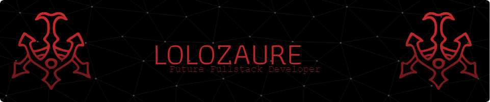

# 👋 Welcome to My GitHub!

I'm **LOLOZAURE**, a future full-stack developer with a passion for multimedia and web development and general modding in the Source Engine.

## 🛠️ Languages and Tools

### Programming Languages
### Front-End Languages

### Back-End Languages

### Creative Tools

## 🌟 Projects
- **Star Wars-Themed RP City**: A roleplay project set in a futuristic city environment using the Helix framework on Garry's Mod.

## 📫 Let's Connect
- [Email](mailto:adamdominguez68@gmail.com)
